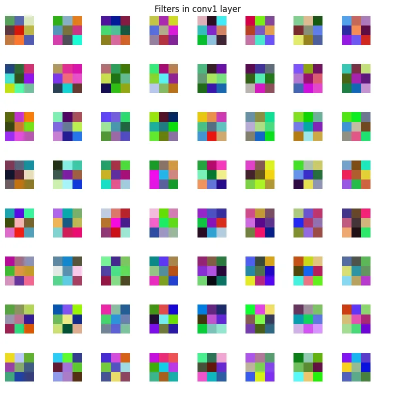

# 심화_1:CNN-Visualization

CNN Visualization 방법을 구현해보기

VGG-11을 이용해서 CNN의 동작과 학습원리에 대한 직관갖기

- gradient정보가 포함하고 있는 의미를 이해하고, 분석해서 활용
- 모델 디버깅에 필요한 기본 방법들 숙지하기
- PreTrain된 모델을 분석하는 방법, 조작하는 방법에 대해 익히기

## 파이토치의 자동미분

파이토치는 `autograd` 를 통해 자동 미분을 한다. Tensor에서 `requires_grad = True` 옵션을 주면 파이토치는 Tensor의 연산을 추적해서 `Computational Graph` 를 만든다. → 이 그래프를 저장해서 Gradient를 자동으로 계산한다.

`backward()` 를 호출하면 만들어둔 Graph를 거꾸로 올라가며 파라미터에 대한 기울기를 자동으로 계산한다. 

`.backward()` 가 실행된 후 `requires_grad = True` 로 설정했던 각 Tensor의 `grad` 속성(attribute)에 계산된 기울기값이 저장된다 → grad값 확인하기

이후 파라미터를 업데이트 하는 역할은 optimizer가 별도로 담당한다

## Data 전처리

pretrain Model: pretrain된 VGG-11 model을 가져온다.

inference 용도의 data: 추론용의 이미지셋을 가져와서 사용한다.

이미지를 tensor에서 numpy로 옮기는 함수, numpy에서 tensor로 옮기는 함수를 정의해준다 → PyTorch는 GPU를 사용하고 Numpy는 CPU를 사용하므로 데이터를 옮겨주는 함수 필요함

## Model definition

```python
import torch.nn as nn

class VGG11Backbone(nn.Module):
    """
    VGG11의 특징 추출기(backbone) 부분입니다.
    nn.Module을 상속받아 구현했습니다.
    """
    def __init__(self, in_channels: int = 3):
        super(VGG11Backbone, self).__init__()

        # VGG11 아키텍처 정의
        # 숫자는 Conv Layer의 출력 채널 수, 'M'은 Max Pooling을 의미합니다.
        self.vgg_config = [64, 'M', 128, 'M', 256, 256, 'M', 512, 512, 'M', 512, 512, 'M']

        # 설정값을 바탕으로 실제 레이어들을 생성합니다.
        self.features = self._make_layers(in_channels)

    def _make_layers(self, in_channels: int) -> nn.Sequential:
        """
        vgg_config를 바탕으로 nn.Sequential 모델을 생성하는 헬퍼 함수
        """
        layers = []
        current_channels = in_channels

        for x in self.vgg_config:
            if x == 'M':
                # Max Pooling 레이어 추가
                layers.append(nn.MaxPool2d(kernel_size=2, stride=2))
            else:
                # Conv-ReLU 블록 추가
                conv2d = nn.Conv2d(current_channels, x, kernel_size=3, padding=1)
                # inplace=True는 메모리 사용량을 약간 줄여줍니다.
                relu = nn.ReLU(inplace=True)
                layers.extend([conv2d, relu])
                current_channels = x
        
        # 생성된 모든 레이어를 nn.Sequential로 묶어서 반환
        return nn.Sequential(*layers)

    def forward(self, x: torch.Tensor) -> torch.Tensor:
        """
        순전파(forward pass)를 정의합니다.
        """
        # 입력 텐서 x를 features 레이어에 통과시킵니다.
        x = self.features(x)
        return x
 
 class VGG11Classification(nn.Module):
    """
    VGG11 Backbone과 Classifier를 결합한 전체 모델입니다.
    """
    def __init__(self, num_classes: int = 1000, in_channels: int = 3):
        super(VGG11Classification, self).__init__()

        # 1. Backbone (특징 추출기)
        self.backbone = VGG11Backbone(in_channels=in_channels)

        # 2. Classifier (분류기)
        # VGG11의 backbone 출력은 (batch_size, 512, 7, 7) 형태입니다.
        self.classifier = nn.Sequential(
            nn.Linear(512 * 7 * 7, 4096),
            nn.ReLU(inplace=True),
            nn.Dropout(p=0.5),
            nn.Linear(4096, 4096),
            nn.ReLU(inplace=True),
            nn.Dropout(p=0.5),
            nn.Linear(4096, num_classes)
        )

    def forward(self, x: torch.Tensor) -> torch.Tensor:
        """
        순전파 로직: Backbone -> Flatten -> Classifier
        """
        # 1. Backbone을 통과시켜 특징 맵을 추출합니다.
        # x shape: (batch_size, 3, 224, 224) -> (batch_size, 512, 7, 7)
        x = self.backbone(x)

        # 2. Classifier에 넣기 위해 1차원으로 펼칩니다 (Flatten).
        # x shape: (batch_size, 512, 7, 7) -> (batch_size, 512 * 7 * 7)
        x = torch.flatten(x, 1)

        # 3. Classifier를 통과시켜 최종 클래스 점수(logit)를 얻습니다.
        # x shape: (batch_size, 512 * 7 * 7) -> (batch_size, num_classes)
        x = self.classifier(x)
        
        return x

```

## Visualizing Structure

VGG11 구조를 Visualization해보자

(1): Module의 parameter개수를 return하는 `get_params_num` 을 구하기

(2): 모델에서 `conv1_filters_data`를 얻는 코드 작성

(3): Activation을 target layer에 시각화하기 위해 hook function을 register하기

- `module.registed_forward_hook(hook_fn)` : 해당 모듈의 activation을 시각화 하기 위해 각 모듈마다 적용되는 `hook_fn` 을 모듈마다 걸어주는 함수
- `Tensor.weight.data` : 해당 텐서의 Weight를 data attribute를 통해 확인하기
- `torch.size()` 토치의 크기 확인하기

### 1. module의 parameter개수를 반환하는 함수 정의하기

```python
def get_module_params_num(module):
  param_num = 0
  for _, param in module.named_parameters():
    param_size = param.numel()
    param_num += param_size
	return param_num
```

module의 파라미터를 `module.named_parameters()` 로 가져와서 각 파라미터는 Tensor이므로 Tensor의 메소드인 `numel()` 을 이용해서 텐서에 포함된 전체 원소의 개수(shape에 해당하는 값의 모든 곱)을 더해서 return하기

### 2. Visualizing conv1 filters

첫번쨰 convolution layer는 RGB형태의 input을 받기 떄문에 첫번쨰 conv1 filter는 RGB image로 변환하여 시각화 할 수 있다. 이후 layer의 filter는 high dimension을 갖기 떄문에 conv layer에 비해 시각화가 어렵다.

해당 layer의 weight를 conv1_filters_data 변수에 할당해서 시각화하기

```python
def plot_filters(data, title=None):
	'''{filter 데이터를 입력으로 받아서 시각화 하는 함수}'''

#VGG11 classification 모델 인스턴스
model = VGG11Classification()
model.load_state_dict(torch.load(model_root))

#모델의 backbone의 attribute conv1의 weight를 data로 불러와서 저장
conv1_filters_data = model.backbone.conv1.weight.data

plot_filters(conv1_filters_data, title="Filters in conv1 layer")
```



### 3. Visualizing model activations

Pytorch에서는 hook을 통해서 최종 출력값이 아닌 중간 layer들의 출력값을 얻을 수 있다. → 모델의 원하는 부분에 hook을 건 다음 해당 layer의 출력을 가져올 수 있다. → 각 layer의 activation을 시각화할 수 있다.

```python
activation_list = []

def show_activations_hook(name, module, input, output):
  # conv/relu layer outputs (BxCxHxW)
  if output.dim() == 4:
    activation_list.append(output)
    plot_activations(output, f"Activations on: {name}")
```

`show_activations_hook` 이 함수는 각 layer에 걸어줄 hook함수이다. layer를 거치고 나온 output을 activation list에다가 넣어준 후 이전에 정의해둔 `plot_activations()` 함수에다가 넣으면 각 layer의 heatmap을 볼 수 있다.

이제 각 module에 forward hook을 걸여줘서 layer의 출력값을 시각화해보자.

1. module.register_forward_hook사용
2. `functools.partial` 을 이용해서 함수의 name 인자가 채워진채로 호출하기 이용

```python
#pretrain된 모델을 불러오고 파라미터를 불러와서 float64로 바꿔줌 -> 이미지와 데이터타입 통일
model = VGG11Classification()
model.load_state_dict(torch.load(model_root))
model.double()

#Hook에 등록할 module담기
module_list  = [model.backbone.conv1, model.backbone.bn4_1]
module_names = ["conv1", "bn4_1"]

#각 module불러와서 register_forward_hook을 이용해서 layer마다 show_activations_hook함수 등록
for idx, (name, module) in enumerate(zip(module_names, module_list)):
  #functools.partial()을 통해서 name인자가 채워진채로 호출
  hook = module.register_forward_hook(functools.partial(show_activations_hook, name))
  module.name = name
  
  #model에 img를 넣어서 hook함수 실행 -> 결과값은 버림
_ = model(img)
```

conv1 layer와 bn4_1 layer를 거치면서 hook_fn을 거친 결과는 다음과 같다.


## Visualizing saliency

saliency map을 시각화해보자. 

saliency map(중요한 맵):CNN에서 각 pixel이 기여하고 있는 정도를 시각화하여 나타낸 것으로 activation map이라고 불림

(1) Input image에 대한 gradient s_y(score at index class_idx)를 return하는 함수 `compute_gradient_score` 만들기

${\partial s_y \over \partial I}$를 계산해서 이미지의 class score($s_y$)에 대한 gradient를 게산할 수 있다.

$s_y$는 class $y$에 대한 logit이다. (softmax layer를 통과하기 이전의 값)

Gradient를 계산한 다음에 해당 값들을 시각화 → input image에 대한 saliency를 확인할 수 있다.

```python
def compute_gradient_score(scores, image, class_idx):
    """
    Returns the gradient of s_y (the score at index class_idx) w.r.t the input image (data), ds_y / dI.

    class_idx에 해당하는 class에 대한 gradient인 s_y를 계산해야 합니다.
    전체 class의 개수의 길이를 갖는 scores에서 원하는 index의 score를 s_y로 얻은 다음, 해당 s_y를 back-propagate하여 gradient를 계산하는 코드를 완성해주세요.
    """
    #grad라는 변수를 image tensor와 동일한 모양의 0으로 채워진 텐서로 초기화
    grad = torch.zeros_like(image)
#목표로 하는 class_idx에 해당하는 스칼라 점수값 선택
    s_y = scores[class_idx]
#s_y에 대한 모든 파라미터 미분
    s_y.backward()
#윗줄에서 계산된 image.grad기울기 텐서값을 grad변수로 가져오기
    grad = image.grad
    assert tuple(grad.shape) == (1, 3, 224, 224)
#계산된 기울기 grad tensor에서 배치차원(인덱스0)을 제거하고 반환
    return grad[0]
```

계산한 Gradient를 시각화하면 아래사진과 같이 나타난다.


(2) Grad-CAM을 시각화하기

`vis_gradcam` 함수를 만들자.

- Layer의 activation을 저장할 function을 hook하고 forward하기
- gradients를 저장하기 위해 hook을 register하고 출력에 대한 최댓값에 해당하는 score를 backwawrd하기

${\partial y^c \over \partial A^k}$를 통해 $\alpha^k_c$를 구할 수 있다.

$y^c$는 class $c$에 대한 score이고, $A^k$는 target layer인 $k$번째 feature map의 Activation이다.

$\alpha^k_c$를 weight로 하여 forwawrd activation maps$A$의 Weighted sum을 얻고, ReLU를 통과하여 $L_{Grad-CAM}^c(i.e,ReLU (\sum_k \alpha_c^k A^k)$를 얻는다.

```python
save_feat=[]
#output feature를 hook_feat에다가 append해서 모아놓기
def hook_feat(module, input, output):
  save_feat.append(output)
  return output

save_grad=[]
#grad를 save_grad 리스트에다가 append해서 모아놓기
def hook_grad(grad):
  """
  중간 layer에서 gradient구하기-> 리스트에 append (dy / dA).
  dy / dA 리턴하기
  """
  save_grad.append(grad)
  return grad

def vis_gradcam(vgg, img):
  """
  gradcam visualization하는 함수
  """
  vgg.eval()

  
  # (1) Reister hook for storing layer activation of the target layer (bn5_2 in backbone)
  # hook_feat의 activation을 register_forward_hook을 이용해서 bn5_2에 등록하기
  vgg.backbone.bn5_2.register_forward_hook(hook_feat)

  # (2) Forward pass to hook features
  # 위에서 hook했으니깐 img forward하기
  img = img.unsqueeze(0)
  s = vgg(img)## FILE ME ##

  # (3) Register hook for storing gradients
  # gradients를 저장하기 위해 hook을 register하기
  save_feat[0].register_hook(hook_grad)

  # (4) Backward score
  # 출력에 대한 최댓값에 해당하는 score를 backward하기
  y = torch.argmax(s)
  s_y = s[0,y]
  s_y.backward()

  # Compute activation at global-average-pooling layer
  # 전역의 average-pooling layer를 통해 activation map 계산
  gap_layer  = torch.nn.AdaptiveAvgPool2d(1)
  alpha = gap_layer(save_grad[1][0].squeeze())
  A = save_feat[0].squeeze()

  # (1) Compute grad_CAM
  # ReLU layer 정의
  # (You may need to use .squeeze() to feed weighted_sum into into relu_layer)
  relu_layer = torch.nn.ReLU()

	# weighted_sum:forward activations maps인 A의 weighted sum구하기
  weighted_sum = torch.sum(save_grad[0].mean(dim=(2,3), keepdim=True) * save_feat[0], dim=1)
  # RelU 통과시키기
  grad_CAM = relu_layer(weighted_sum.squeeze())

  grad_CAM = grad_CAM.unsqueeze(0)
  grad_CAM = grad_CAM.unsqueeze(0)

  # (2) Upscale grad_CAM
  # (You may use defined upscale_layer)
  # grad_CAM 업스케일링 하기
  upscale_layer = torch.nn.Upsample(scale_factor=img.shape[-1]/grad_CAM.shape[-1], mode='bilinear')

  grad_CAM = upscale_layer(grad_CAM)
  grad_CAM = grad_CAM.squeeze()

	#plt 이용해서 grad_CAM시각화하기 
  # Plotting
  #plt 이용하려면 tensor에서 numpy로 바꿔줘야됨
  img_np = image_tensor_to_numpy(img)
  if len(img_np.shape) > 3:
    img_np = img_np[0]
  img_np = normalize(img_np)

  grad_CAM = grad_CAM.squeeze().detach().numpy()

  plt.figure(figsize=(8, 8))
  plt.imshow(img_np)
  plt.imshow(grad_CAM, cmap='jet', alpha = 0.5)
  plt.show

  return grad_CAM
```


시각화한 결과 grad_CAM을 시각화해서 Saliency map을 얻어냈다. → 모델의 변형없이 한번의 back_propagation으로 Class activation map을 구함.