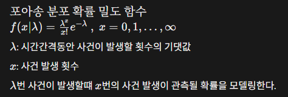

# 심화_Word2vec구현&Embedding시각화

1. 주어진 단어들을 word2vec 모델에 들어갈 수 있는 형태로 만들기
2. CBOW, skip-gram모델을 각각 구현 및 학습
3. 학습된 Embedding 결과를 PCA와 t-SNE로 시각화

Word2Vec의 개념을 이해하고 CBOW와 skip-gram 모델의 학습 방법 및 차이점을 이해하기 → 모델을 시각화해서 Word Embedding 의미 확인하기

## Dataset클래스 정의하기

실제 CBOW, skip-gram모델에 들어가기 위한 input을 만들기 위해 Dataset 클래스 정의하기

```python
class CBOWDataset(Dataset):
  def __init__(self, train_tokenized, window_size=2):
    self.x = []
    self.y = []

    for tokens in train_tokenized:
      for i in range(window_size, len(tokens)-window_size):
        #주변단어 id리스트인 context 생성
        context = []
        #중심단어 왼쪽으로 주변단어 넣기
        for j in range(window_size,0,-1):
          context.append(w2i[tokens[i-j]])
        #중심단어 오른쪽으로 주변단어 넣기
        for j in range(1,window_size+1):
          context.append(w2i[tokens[i+j]])
        #x에다가 주변단어 넣기
        self.x.append(context)
        #y에다가는 중심단어 넣기
        self.y.append(w2i[tokens[i]])

    self.x = torch.LongTensor(self.x)  # (전체 데이터 개수, 2 * window_size)
    self.y = torch.LongTensor(self.y)  # (전체 데이터 개수)

  def __len__(self):
    return self.x.shape[0]

  def __getitem__(self, idx):
    return self.x[idx], self.y[idx]
```

실제 모델에 들어갈 input → 주변단어 x, 중심단어 y를 input 쌍으로 만들어줌

`전체 데이터의 개수`: 만들어지는 (x,,y)쌍의 총 개수

`2*window_size` : 하나의 중심단어를 예측하는 데 사용될 주변 단어의 개수

예를들어 `window_size = 2`면 왼쪽2개 오른쪽 2개

## 모델 Class 구현

`self.embedding, self.linear`를 이용해서 `CBOW, skipgram` 두가지Word2Vec모델을 구현해보자.

`self.embedding` : `vocab_size` 크기의 one-hot vector를 특정 크기의 `dim` 차원으로 `embedding` 시키는 layer

`self.linear` : 변환된 `embedding vector`를 다시 원래 `vocab_size`로 바꾸는 layer

### CBOW 모델

분포가설에 의해서 문맥을 통해서 의미를 결정하는 모델. 즉 빈칸추론모델

주변단어의 문맥을 파악해서 빈칸의 단어를 예측해 내는 모델이다.

**학습과정**

- 입력: 중심 단어를 비워두고 중심단어들이 있는 입력과 정답레이블로 구성된 데이터셋을 구축한다.
- 임베딩: 각 주변 단어를 임베딩 벡터로 변환한다.
- vector 평균화: 모든 주변 단어 벡터들의 평균을 구해서 하나의 ContextVector를 만든다. → RNN과 다르게 순서를 고려하지 않는다.
- Prediction: 문맥벡터를 이용해서 중심단어를 vocavulary에서 예측한다.
- 학습: prediction과 정답 label을 비교해서 BackPropagation을 진행

```python
class CBOW(nn.Module):
  def __init__(self, vocab_size, dim):
    super(CBOW, self).__init__()
    self.embedding = nn.Embedding(vocab_size, dim, sparse=True)
    self.linear = nn.Linear(dim, vocab_size)

  # B: batch size, W: window size, d_w: word embedding size, V: vocab size
  def forward(self, x):  # x: (B, 2W)

		#입력 배치를 임베딩하기
    embeds=self.embedding(x)
    #vector평균화하기
    embeds=torch.mean(embeds,dim=1)
    #변환된 embedding을 다시 원본 vocab_size로 바꾸기
    output=self.linear(embeds)

    return output
```

`embedding, linear` 는`nn.Module` 에서 가져와서 사용한다.

### Skip-Gram모델

CBOW가 빈칸채우기였다면 skip-gram은 하나의 단어가 주어졌을때 그 주변단어를 Prediction하는 모델이다.

**학습과정**

- 입력: 문장에서 주변단어 하나를 모델에 입력한다.
- 임베딩: 중심단어를 임베딩 벡터로 변환한다.
- 예측: 하나의 중심단어 벡터를 이용해 주변에 올 단어들이 무엇인지 prediction한다.
- 학습: 모델이 예측한 주변 단어들과 실제 정답 단어들을 비교하여 예측을 더 잘하도록 embedding vector값을 업데이트 한다.

skip-gram은 하나의 중심단어에 대해 여러번 예측하고 학습을 진행한다. 예를들어 `window_size=2`일떄 왼쪽 2번째 단어 예측, 왼쪽 1번째 단어예측, 오른쪽 1번째 단어예측, 오른쪽 2번쨰 단어예측…

```python
class SkipGram(nn.Module):
  def __init__(self, vocab_size, dim):
    super(SkipGram, self).__init__()
    self.embedding = nn.Embedding(vocab_size, dim, sparse=True)
    self.linear = nn.Linear(dim, vocab_size)

  # B: batch size, W: window size, d_w: word embedding size, V: vocab size
  def forward(self, x): # x: (B)
 
    embeds=self.embedding(x)
    output=self.linear(embeds)

    return output
```

CBOW모델에서 평균을 구하는 mean이 빠진것 말고는 동일하다

### CBOW Model Traning

```python
from statistics import fmean as mean

cbow.train()
cbow = cbow.to(device)
optim = torch.optim.SGD(cbow.parameters(), lr=learning_rate)
loss_function = nn.CrossEntropyLoss()
print(len(cbow_loader))
losses = []
for e in range(1, num_epochs+1):
  print("#" * 50)
  print(f"Epoch: {e}")
  for batch in tqdm(cbow_loader):
    
    #batch 리스트를 두개의 텐서로 나눈 뒤에 GPU에 올린다.
    context_ids, target_ids = batch
    context_ids=context_ids.to(device)
    target_ids=target_ids.to(device)

    cbow.zero_grad()
    log_probs = cbow(context_ids)
    loss = loss_function(log_probs, target_ids)
    loss.backward()
    optim.step()

   

    losses.append(loss.item())
  print(f"Train loss: {mean(losses)}")

print("Finished.")
```

### skip-gram Model Traning

```python
skipgram.train()
skipgram = skipgram.to(device)
optim = torch.optim.SGD(skipgram.parameters(), lr=learning_rate)
loss_function = nn.CrossEntropyLoss()

losses = []
for e in range(1, num_epochs+1):
  print("#" * 50)
  print(f"Epoch: {e}")
  for batch in tqdm(skipgram_loader):
    
    context_ids, target_ids = batch
    context_ids=context_ids.to(device)
    target_ids=target_ids.to(device)

    cbow.zero_grad()
    log_probs = cbow(context_ids)
    loss = loss_function(log_probs, target_ids)
    loss.backward()
    optim.step()
    

    losses.append(loss.item())
  print(f"Train loss: {mean(losses)}")

print("Finished.")
```

skipgram과 CBOW의 학습코드는 일반적으로 모델 학습시 사용하는 파이프라인을 따른다. `conetext_id`와 `target_id`로 `batch`에서 받아오고 두 id를 GPU에 올린다. 그 후 모델을 돌려서 prediction값을 뽑아낸 후 사전에 정의한 CrossEntropy Lossfuction으로 loss를 계산한 후 backpropagation을 진행한다.

## 테스트결과



test단어들의 word embedding이 성공적으로 진행된것을 볼 수 있다.

## Embedding 시각화

학습을 통해 각 단어의 의미를 embedding에 녹여냈지만, 한눈에 알아보기는 어렵다 → 시각적으로 알아볼 수 있게끔 차원축소를 통해 2~3차원으로 낮추어 시각화할 필요가 있다.

### PCA

주성분분석 PCA를 통해 차원축소를 할 수 있다. Scikit-learn의 PCA 모듈을 이용해서 차원축소를 할 수 있다.


### t-SNE

t-SNE는 학습을 통해서 차원축소를 할 때, 가까운 벡터는 더 가깝게, 먼 벡터는 더 멀게 배치를 한다. → 차원은 clustering처럼 embedding들이 군집을 이룬다.


시각화 결과를 봤을때 PCA보다 비슷한 embedding이 더 군집화 되어있고, 비슷하지 않은 embedding은 더 멀어져있음을 확인할 수 있다.